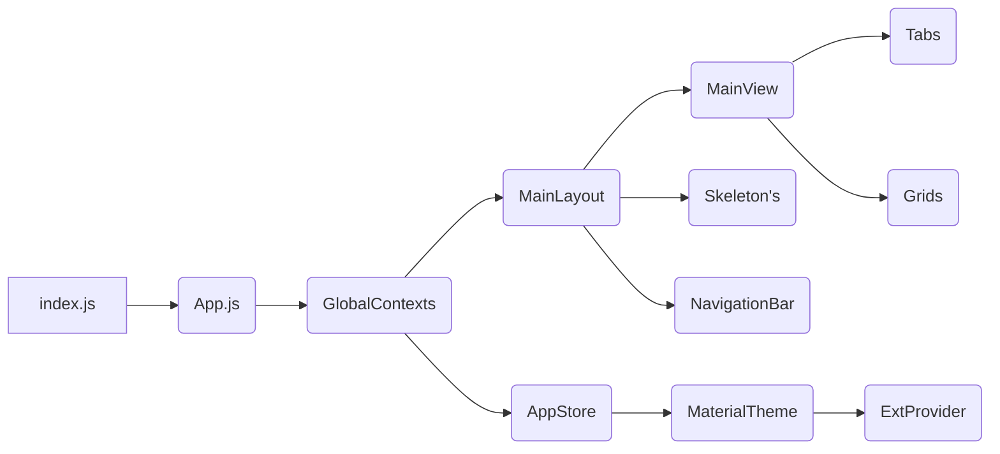

# React ReExt: Ext JS Grid Example

> Brief description of the project and its purpose.

<div style="display: flex; gap: 8px;">
  
  
  
  
</div>

This project was bootstrapped with [Create React App](https://github.com/facebook/create-react-app).

## Table of Contents

-   [Overview](#overview)
-   [Features](#features)
-   [Technologies Used](#technologies-used)
-   [Prerequisites](#prerequisites)
-   [Installation](#installation)
-   [Using Styled-Components](#using-styled-components)
-   [Project Structure](#project-structure)
-   [License](#license)

## Overview


### Build enterprise-grade web apps faster with Ext JS.

[Ext JS](https://www.sencha.com/products/extjs/) is a powerful JavaScript framework with over 140 ready-made components, including grids, charts, and data visualization tools. It integrates seamlessly with the Sencha platform, allowing you to focus on building your app's functionality instead of wrestling with the framework. This reduces development time and maintenance costs, getting your app to market quicker.

**See it in action:** [Explore example](https://examples.sencha.com/extjs/7.8.0/) projects built with Ext JS.

## Features

- Multi theme
- Dark mode
- Theme colors (Material)
- Multi locale
- Feature rich grid with many plugins
- Multi Grouping Grid
- Pivot Grid
- Grid Export to many file formats (xlsx, html, csv, etc...)

## Technologies Used

-   [React](https://reactjs.org/)
-   [ReExt JS](https://www.npmjs.com/package/@gusmano/reext) seamlessly integrates Sencha Ext JS.
-   [Styled-Components](https://styled-components.com/) use component-level styles using CSS-in-JS.
-   [React Loading Skeleton](https://www.npmjs.com/package/react-loading-skeleton) animated loading skeletons.

## Prerequisites

Before you begin, ensure you have met the following requirements:

-   You have installed the latest version of `<Node.js / npm / yarn>`
-   You have a `<Windows / Linux / Mac>` machine.

## Installation

Steps to install and set up the project environment.

1. Clone the repository
    ```bash
    git clone https://github.com/sencha-extjs-examples/react-reext-grid-example.git
    cd react-reext-grid-example
    ```
2. Install dependencies
    ```bash
    npm install
    # or
    yarn install
    ```
3. Start the development server

    ```bash
    npm run start
    # or
    yarn start

    # You can now view reextcra in the browser.
    # Local: http://localhost:3000
    # Note that the development build is not optimized.
    # To create a production build, use npm run build.


### If you are a TRIAL customer

In this application example we are using some premium packages from Sencha, and you can download the addons trial version by signing
 up the form sencha sends to you by an email with the download links

[Sign up for the trial to download the zip](https://www.sencha.com/products/evaluate/)


### Add the Add-ons Components to your Project

#### Step 1: Extract the zip
Open the zip and extract the resources into the public folder that you can keep as a reference to Ext JS resources.

#### Step 2: Copy the Add-ons packages
In this step, you copy the add-ons packages to your project. In this example we will use the Pivot and exporter add-ons as the example package.

Copy the ext-addons folder [ext-addons-7.8.0-trial.zip]/packages to [project]/public/.


### If you are an ACTIVE customer

Download Ext JS and Ext Js Premium packages from support portal and extract it to public folder


### Run the app

    $ npm start


## ReExt


### Try ReExt: Sencha ExtJS Components in React

A comprehensive UI components library for React. Leverage Ext JS 140+ pre-built components like grids, forms, charts, etc. to build feature-rich interfaces at incredible speed, without compromising on functionality or performance.


### Folder Structure for Example

For the creation of this example, the initial structure was used and complemented with new folders inside `./src`.

```bash
reext-extjs-grid-example/src/
├── components/ 		# Folder used to centralize React components.
│   ├── NavigationBar/
│   └── Skeleton/
├── config/
│   ├── locale/						# Text internationalization used in the example
│   ├── profile/					# Application customizations by profile
│   ├── theme/						# Customizations to override colors
│   ├── ExtArtifacts.js				# Initialization and loading of artifacts
│   ├── ReExtData.json				# Configurations for the ReExt SDK used by the provider
│   └── setupExtConfig.js			# Functions for loading Ext resources
├── contexts/
│   ├── AppStore.jsx				# Stores language, theme, color, and tab settings.
│   ├── ExtProvider.jsx				# Required for the proper functioning of ReExt components
│   ├── GlobalContexs.jsx 			# Centralizes the application of other contexts
│   └── MaterialThemeProvider.jsx   # Adds dynamic settings to the native theme
├── ext/
│   ├── model/						# Definition of models used by stores and grids
│   ├── sim/						# Definition of service return mocks
│   ├── store/						# Definition of stores used by grids
│   └── ux/							# Definition of Ext components
├── layout/
├── view/
└── ...


```

Flow of artifact execution.



## Using Styled-Components

`styled-components` is a library for React and React Native that allows you to use component-level styles using a technique called CSS-in-JS. This means you can write CSS directly within your JavaScript file, enhancing the modularity and maintainability of your code.

### Usage Example

Here is a simple example of how to use `styled-components` in your project:

```jsx
// src/components/ExemploComponente.js
import React from "react";
import styled from "styled-components";

const Button = styled.button`
    background: violet;
    color: #000;
    margin: 1em;
    padding: 0.25em 1em;
    border: 2px solid palevioletred;
    border-radius: 4px;
`;

export const ExampleComponent = () => (
    <div>
        <Button>Click Me</Button>
    </div>
);
```

In the example above, we create a styled `Button` component using the `styled.button` function. We can define CSS styles directly within a template literal. This component can be used like any other React component. See the example below.

```jsx
// src/App.js
import React from "react";
import ExampleComponent from "./components/ExampleComponent";

export const App = () => (
    <div>
        <h1>Meu Projeto React</h1>
        <ExampleComponent />
    </div>
);
```


### Next Steps:

Now that you are on a successful path to building Ext JS applications with React ReExt, take some time to explore how to enhance your apps using hundreds of UI components, design, testing and debugging tools.

Explore more [examples](https://examples.sencha.com/extjs/), [resources](https://www.sencha.com/resources/) and [documentation](https://docs.sencha.com/extjs/).
